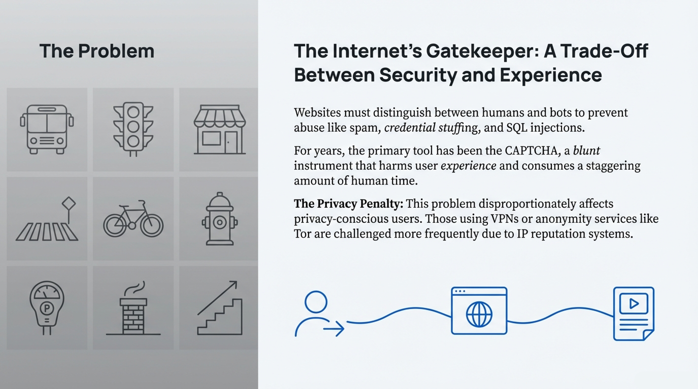
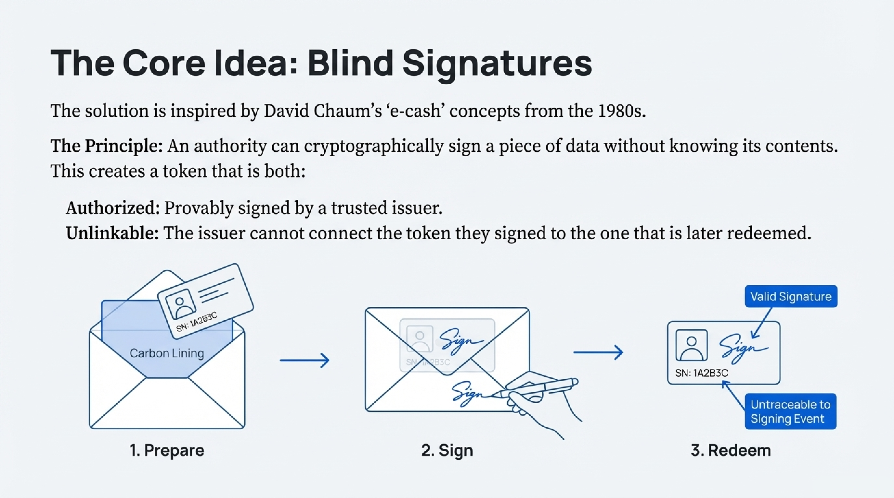
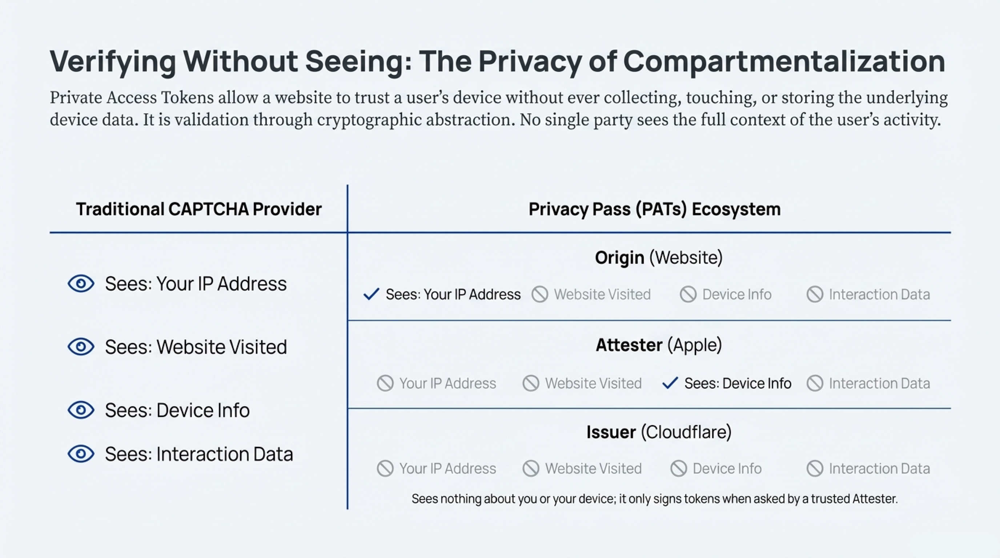

# Privacy Pass: Private Access Without CAPTCHAs

> A field guide to the standardized, privacy-preserving way to prove that a person—not a bot—is behind a request.

*Figure 1 – Overview excerpted from `Privacy_Pass_Web_Standard.pdf`.*

## Why Privacy Pass Matters

- CAPTCHA fatigue wastes countless hours and disproportionately punishes users on VPNs, mobile networks, or Tor.
- Cross-site cookies cannot be re-used because of the Web Origin Policy, so solving one challenge does nothing for the next site.
- Fingerprinting or IP reputation offer weak signals, leak metadata, and still fail to stop sophisticated bots.

Privacy Pass replaces that mess with a reusable, unlinkable “trust bit.” If a user earns a token from a trustworthy attester once, they can present it elsewhere without revealing who they are, what device they use, or where they earned it.

## Design Pillars

1. **Privacy first** – no single party can see both the attestation context and the site where the token is redeemed.
2. **Cryptographic verifiability** – relying parties can locally verify a token using lightweight elliptic-curve math (RFC 9497 VOPRFs).
3. **Deployable today** – the protocol runs over standard HTTPS, survives CDN/proxy hops, and already ships in mobile operating systems.

## Cryptographic Building Blocks

### Blind Signatures ➜ Anonymous Authorization

Privacy Pass inherits the blind-signature trick from Chaumian e-cash: the issuer signs a value it never learns, so redemption cannot be linked back to issuance.

*Figure 2 – Blind-signature walkthrough extracted from `Privacy_Pass_Web_Standard.pdf`.*

### VOPRFs ➜ Fast, Verifiable Tokens

Classic RSA-based schemes were too heavy for the web, so the standard embraces Verifiable Oblivious Pseudorandom Functions:
- **OPRF** lets the client query a function without revealing its input.
- **VRF** proves to everyone else that the function used the right private key.
- Combined, a **VOPRF** yields an unlinkable token that a browser can mint in milliseconds and a server can verify offline.

## Four-Party, Compartmentalized Architecture

The modern deployment separates duties so trust is never concentrated:

1. **Client** – requests tokens when challenged and stores them locally.
2. **Attester** – confirms a property about the client (device integrity, user presence, etc.).
3. **Issuer** – blind-signs the token after seeing proof from the attester.
4. **Origin/Relying Party** – redeems the token to skip intrusive challenges.

*Figure 3 – Role separation excerpted from `Privacy_Pass_Web_Standard.pdf`.*

This compartmentalization is what lets Apple ship Private Access Tokens (PATs): the Secure Enclave acts as an attester, Apple runs the issuer, and any participating website can trust the final token without learning device fingerprints.

## Token Lifecycle at a Glance

1. **Challenge:** A site, CDN, or API gateway requests proof instead of showing a CAPTCHA.
2. **Attestation:** The client proves something (hardware integrity, recent passkey use, etc.) to the attester.
3. **Issuance:** The issuer runs the VOPRF, blind-signs the token, and hands it back.
4. **Redemption:** When another property requires proof, the client redeems one token; the origin checks the signature and rate-limits by key ID, not IP.

The only metadata that leaves the user’s device is a yes/no answer signed under a key that can be revoked if abused.

## Real-World Deployments

- **Apple Private Access Tokens** (iOS 16+, macOS Ventura) dramatically reduce CAPTCHA prompts for Safari and third-party apps.
- **Cloudflare & Fastly** operate issuers and attesters, open-sourcing Workers templates so anyone can run their own stack.
- **Browser extensions** such as Silk implement the client role, bringing tokens to legacy browsers, Tor, or CLI tooling.

## Open-Source Building Blocks

| Component | Purpose | Link |
| --- | --- | --- |
| `pp-attester` | Cloudflare Worker template for building custom attesters | https://github.com/cloudflare/pp-attester |
| `pp-issuer` | Reference issuer that speaks the latest IETF drafts | https://github.com/cloudflare/pp-issuer |
| `pp-browser-extension` | Client UX for redeeming tokens in Chromium-based browsers | https://github.com/cloudflare/pp-browser-extension |
| `silk` | Experimental standalone client for automation-heavy workflows | https://github.com/cloudflare/pp-browser-extension (silk branch) |

Clone one of the templates, set your own keys, and you can stand up a compliant issuer/attester pair in minutes.

## How to Explore This Repository

1. **Read the PDF** – `Privacy_Pass_Web_Standard.pdf` is a visual primer on the protocol and the slides source for the embedded figures.
2. **Skim the RFCs** – RFC 8941 (Structured Field Values) and RFC 9497 (VOPRF) describe the wire format and crypto used in Privacy Pass extensions.
3. **Experiment** – Use the open-source Workers templates to deploy a minimal issuer, then instrument your application to request tokens before allowing sensitive actions.

## Further Reading

- IETF Privacy Pass Working Group drafts: https://datatracker.ietf.org/wg/privacypass/about/
- Apple Private Access Tokens overview: https://developer.apple.com/documentation/devicecheck/implementing_private_access_tokens
- Cloudflare’s explainer: https://blog.cloudflare.com/tag/privacy-pass/

*All figures in this README were exported directly from `Privacy_Pass_Web_Standard.pdf` and remain subject to their original license.*
